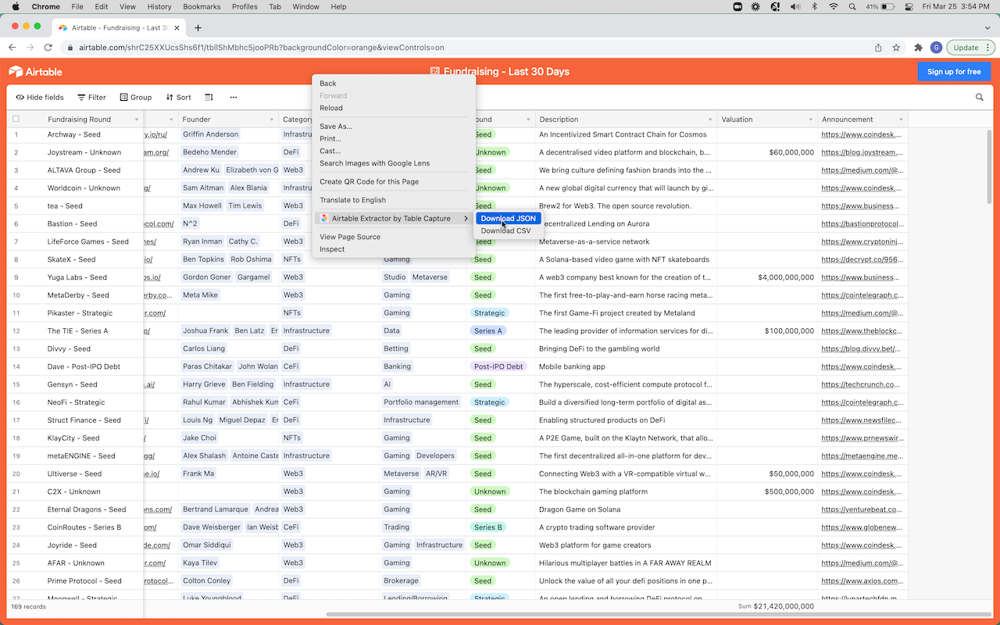

# Airtable Data Extractor

This extension allows you to extract raw data (JSON or CSV) from an Airtable shared view.

Here's a screenshot of it:

# Thanks

- Forked from: https://github.com/gmcabrita/airtable-data-extractor-extension
- https://github.com/samuelsimoes/chrome-extension-webpack-boilerplate
